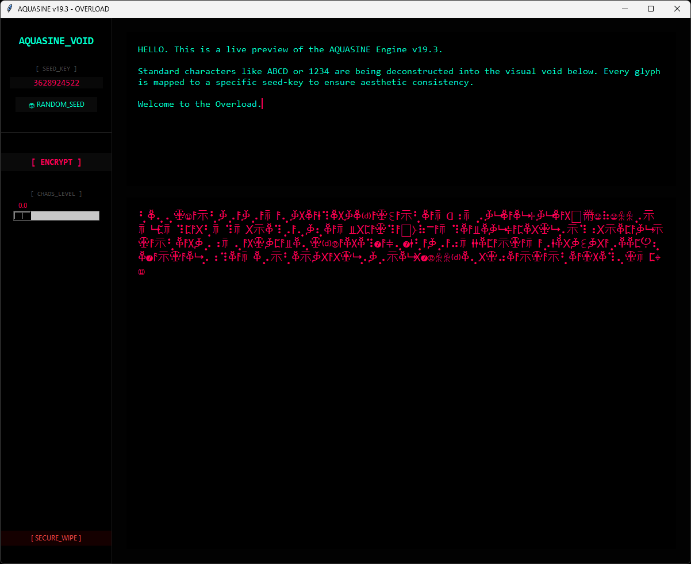
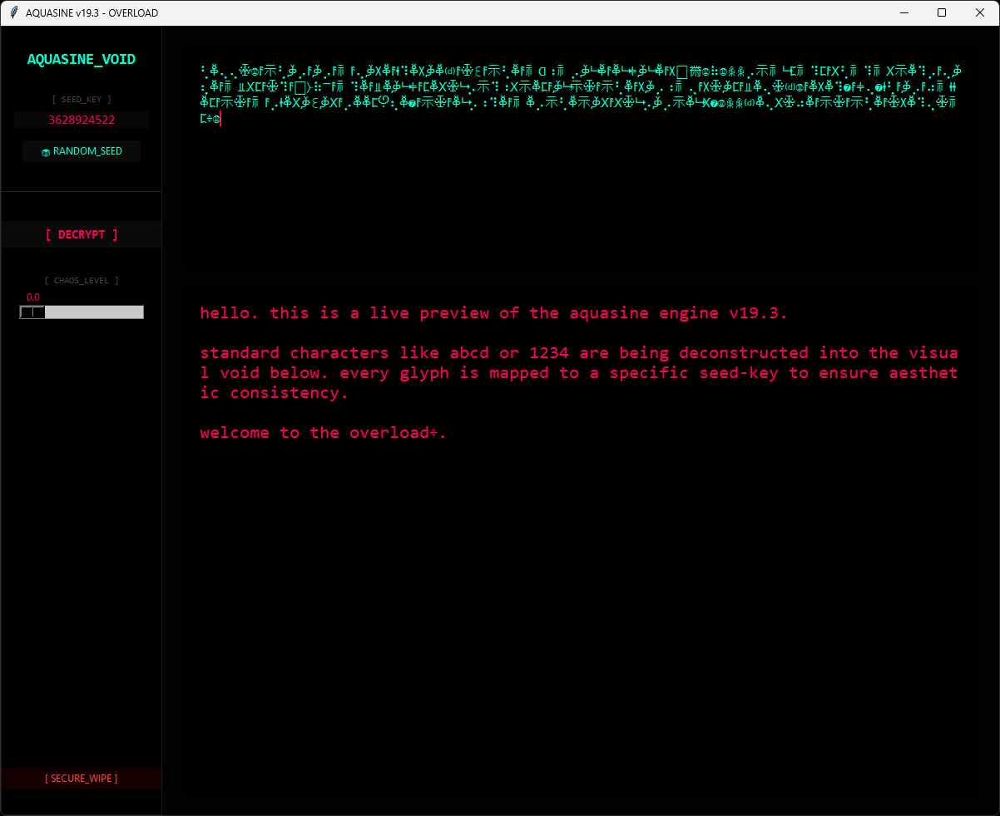

```text
  █████╗  ██████╗ ██╗   ██╗  █████╗  ███████╗ ██╗ ███╗  ██╗ ███████╗
 ██╔══██╗██╔═══██╗██║   ██║ ██╔══██╗ ██╔════╝ ██║ ████╗ ██║ ██╔════╝
 ███████║██║   ██║██║   ██║ ███████║ ███████╗ ██║ ██╔██╗██║ █████╗  
 ██╔══██║██║▄▄ ██║██║   ██║ ██╔══██║ ╚════██║ ██║ ██║╚████║ ██╔══╝  
 ██║  ██║╚██████╔╝╚██████╔╝ ██║  ██║ ███████║ ██║ ██║ ╚███║ ███████╗
 ╚═╝  ╚═╝ ╚══▀▀═╝  ╚═════╝  ╚═╝  ╚═╝ ╚══════╝ ╚═╝ ╚═╝  ╚══╝ ╚══════╝
              >> HEX-SHIFT ENTROPY NODE v20.6 <<
```

# ⎋ AQUASINE v20.5


**AQUASINE** is a high-frequency Hex-Shift generator that transforms ordinary text into an unreadable stream of mathematical glyphs and cryptic Unicode blocks. Version 20.5 abandons static pools in favor of direct **Unicode Point Manipulation**.

By shifting character codes directly into the mathematical Unicode block, it creates unique, glitchy textures that are 100% reversible with the correct seed.

---

## ◈ HOW IT WORKS (THE LOGIC)

Unlike traditional ciphers that replace 'A' with 'B', AQUASINE uses **Dynamic Positional Hex Shifting**. 

### 1. Entropy Generation
For every single character in your text, the engine generates a unique "Entropy Shift" based on two factors:
* **The Master Seed:** Your chosen numerical key.
* **The Index (Position):** The character's placement in the string.

### 2. The Shift Equation
The transformation follows this mathematical rule:
$$Code_{new} = Base_{glyph} + (Code_{orig} + Shift_{pos}) \pmod{Range}$$

* **Base_glyph (0x2A00):** This anchors the output in the "Mathematical Operators" Unicode block, ensuring a consistent "Glitch" aesthetic.
* **Shift_pos:** A pseudo-random value derived from `Seed + Position`. This creates the **Ghost Effect**: typing "AAAAA" will result in five *different* glyphs because each position has a different shift.

### 3. Seamless Decryption
Since the shift is purely mathematical, it is 100% reversible. As long as the **Master Seed** remains the same, the engine can calculate the exact negative shift to return the glyph back to its original ASCII/UTF-8 value.

### 4. TRANSFORMATION EXAMPLE
**Input:** `preview text`  
**Seed:** `73966`  
**Output:** `⮮⬡⪣⯁⨄⮤⫒ ⭌⪏⯻⨺`

---

## ◈ CORE FEATURES

* **RAW HEX PROJECTION:** Terminating the era of static lookup tables. The engine operates directly on the Unicode architecture, projecting ASCII values into high-density glyph coordinates via mathematical offsets.
  
* **INDEX-BASED ENTROPY:** Execution of the Ghost-Stream protocol. Every character is modulated by its unique stream index. Identical input strings (e.g., "XXXXX") result in non-repetitive, chaotic visual sequences to bypass pattern recognition.
  
* **AUTO-STATE DETECTION:** Intelligent node sensing. The system analyzes the entropy density of the input to autonomously toggle between Injection (Encryption) and Extraction (Decryption) without manual override.
  
* **VOLATILE BUFFERING:** Zero-trace execution. All transformations occur strictly within the volatile RAM. No keys, plaintexts, or temporary buffers are committed to physical storage.
  
* **LOGIC-GATE SANITIZATION:** Active stream integrity. Hardcoded boundary filters prevent the injection of control characters or "dead-weight" symbols that would otherwise corrupt the visual field or compromise stream stability.

---

## ◈ UI CONTROLS

| Component | Description |
| :--- | :--- |
| `[ ENTROPY_SEED ]` | The mathematical key used for the current mapping. |
| `[ RE-SEED ]` | Generates a new random entropy base. |
| `[ COPY ]` | Copies the current output stream to your clipboard. |
| `INPUT_NODE` | Source area for text or encrypted glyphs. |
| `OUTPUT_STREAM` | The result of the real-time transformation. |

---
### [01] System Interface

*The operational terminal of the v19.3 Engine.*

### [02] Visual Deconstruction

*Close-up of the high-density glyph stream generated by the Overload protocol.*
---

*Licensed under the AQUASINE Non-Commercial License. Use at your own risk.*
